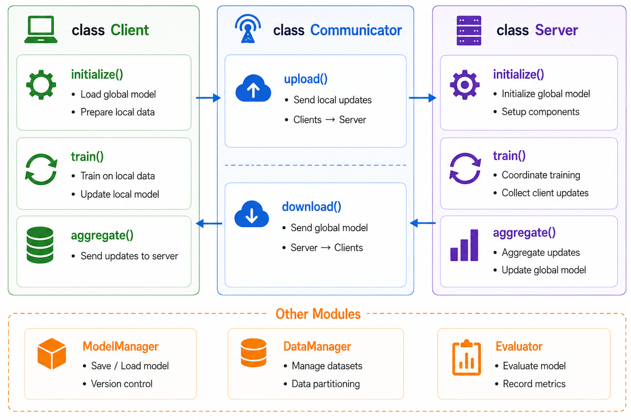
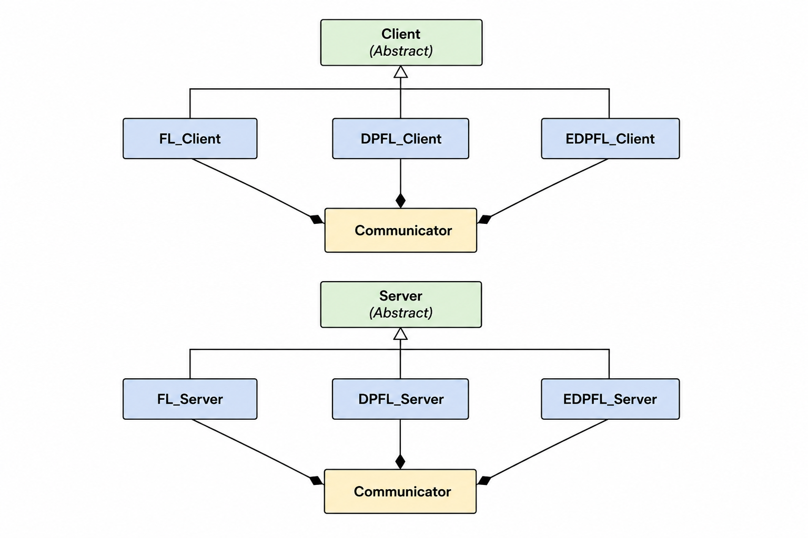
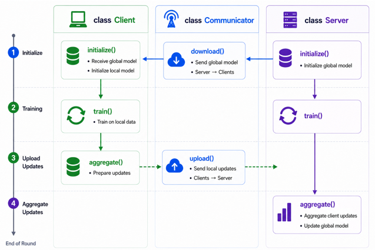
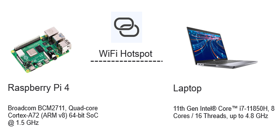

# EDPFL: Efficient DNN Partitioning-Based Federated Learning

This repository accompanies the **live demonstration** of **Session 2** of the **IEEE IoT Seasonal School 2026**.

The tutorial demonstrates how different Federated Learning (FL) systems operate in practice on resource-constrained IoT devices, including Raspberry Pi boards and a laptop server. Three representative systems are presented throughout the tutorial:

- **Classic Federated Learning (FL)**
- **DNN Partitioning-Based Federated Learning (DPFL / Split Federated Learning)**
- **Efficient DNN Partitioning-Based Federated Learning (EDPFL)**, proposed in my PhD thesis ([Distributed Machine Learning on Edge Computing Systems](https://research-portal.st-andrews.ac.uk/en/studentTheses/distributed-machine-learning-on-edge-computing-systems/)).

This repository is designed as an educational codebase for learning the implementation of FL and DPFL systems. It also contains the complete implementation of the EDPFL framework developed during my PhD research.

The repository supports both:
- Distributed deployment on Raspberry Pi devices
- Single-machine simulation for development and debugging

---

# Tutorial Overview

The live demonstration covers the following topics:

- Quick recap of Federated Learning
- Quick recap of Split Federated Learning
- Introduction to EDPFL
- Code architecture and core classes
- One-round training workflow
- Testbed and workload configuration
- Metrics and visualization
- Live demonstration
- Key takeaways

---

# Repository Structure

```text
EDPFL_Project/
├── EDPFL/
│   ├── core/
│   │   ├── client/                 # Client implementation
│   │   ├── client_sampler/         # Client sampling
│   │   ├── communicator/           # Communication module
│   │   ├── data_generator/         # Dataset generation
│   │   ├── ecofed/                 # EcoFed module
│   │   ├── fedadapt/               # FedAdapt module
│   │   ├── fedfreeze/              # FedFreeze module
│   │   ├── model/                  # Neural network models
│   │   ├── server/                 # Server implementation
│   │   ├── wandb/                  # Experiment logging
│   │   ├── clientrun.py            # Client entry
│   │   ├── serverrun.py            # Server entry
│   │   ├── config.yml              # System configuration
│   │   ├── ecofed_config.yml       # EcoFed configuration
│   │   ├── fedadapt_config.yml     # FedAdapt configuration
│   │   └── fedfreeze_config.yml    # FedFreeze configuration
├── dataset/                        # Training datasets
├── pretrained/                     # Pretrained models
└── README.md
```
# Core Classes and Components

The figure below illustrates the major components of the EDPFL framework.

<p align="center">
  
</p>


The UML class diagram is shown below.
<p align="center">
  
</p>

# One-Round Training Workflow

The following figure shows the execution workflow of one communication round in EDPFL.

<p align="center">
  
</p>

---

# Hardware Setup

The live demonstration uses:

- 1 × Windows/Linux laptop (FL server)
- 2 × Raspberry Pi 4 devices (FL clients)
- A Wi-Fi hotspot or local wireless network

<p align="center">

</p>

---

# Software Requirements

## Server

- Python 3.11
- PyTorch
- Torchvision
- NumPy
- PyYAML
- tqdm
- scikit-learn
- Weights & Biases (wandb)

## Raspberry Pi

- Raspberry Pi OS
- Python 3.11
- Same Python dependencies as the server

---

# Installation

## Step 1. Create the project directory

```bash
mkdir EDPFL_Project
cd EDPFL_Project
```

Create the following folders:

```text
dataset/
pretrained/
```

---

## Step 2. Clone the repository

```bash
git clone <repository-url>
```

---

## Step 3. Create a Python environments on clients and the server

Using **uv**:

```bash
uv python install 3.11

uv init --python 3.11

uv add \
    pyyaml \
    numpy \
    torch \
    torchvision \
    tqdm \
    scikit-learn \
    wandb
```

---

# Configuration

Before running the tutorial, modify `config.yml`.

Example:

```yaml
Network:
  PI:
    SERVER_ADDR: 192.168.137.1
    SERVER_PORT: 52000
```

The most commonly used FL parameters are listed below.

```yaml
FL:
  K: 2                  # Number of clients
  C: 1                  # Number of simulation clusters
  ALPHA: 0.02           # Client sampling ratio
  NON_IID: ON           # Enable non-IID data partition
  NUM_SHARDS: 500       # Number of data shards
  R: 10                 # Number of communication rounds
  E: 1                  # Local training epochs
  B: 20                 # Batch size
  LR: 0.01              # Learning rate
  LR_FACTOR: 0.1        # Learning rate decay factor
  LR_SCHEDULE: 100-100  # Learning rate decay schedule
  PRETRAINED_INIT: OFF  # Enable pretrained initialization
  PRETRAINED_INIT_PATH: ~/Desktop/IEEE Seasonal School/EDPFL_Project/pretrained/ResNet12_Tiny-ImageNet.pth
  SEED: 0               # Random seed
```

The remaining configuration files (`fedadapt_config.yml`, `ecofed_config.yml`, and `fedfreeze_config.yml`) contain algorithm-specific hyperparameters for the corresponding optimization modules.

---

# Running the Server

```bash
cd core

python serverrun.py \
    --testbed PI \
    --dataset CIFAR10 \
    --model LeNet \
    --mode FL
```

---

# Running Raspberry Pi Clients

On Raspberry Pi:

```bash
cd core

python clientrun.py \
    --testbed PI \
    --dataset CIFAR10 \
    --model LeNet \
    --mode FL \
    --index 0
```

Launch the second client using

```bash
--index 1
```

> **Note:** `--mode` supports three options:
>
> - `FL` – Classic Federated Learning
> - `DPFL` – DNN Partitioning-Based Federated Learning (Split Federated Learning)
> - `EDPFL` – Efficient DNN Partitioning-Based Federated Learning
---

# Training Workflow

The live demonstration follows the workflow below:

1. Start the FL server
2. Launch Raspberry Pi clients
3. Clients connect to the server
4. The global model is distributed
5. Local training starts
6. Clients upload model updates
7. The server aggregates the updates
8. The next communication round begins

---

# Troubleshooting

### Clients cannot connect

- Ensure all devices are connected to the same network.
- Verify that the server IP address is correct.
- Check your firewall settings and ensure the server port is allowed.

---

### Socket Address Already in Use

This error usually indicates that the server port is already occupied by another process.

Terminate the existing process or choose a different port.

On **Windows**, you can stop the process using:

```bash
taskkill /PID <PID> /F
```

You can identify the process ID (PID) with:

```bash
netstat -ano | findstr :52000
```

---

### Unsupported Pickle Protocol

```
ValueError: unsupported pickle protocol
```

This error occurs when the server and clients are running different Python versions.

---

### Pretrained Weights Loading Error

This happens when pretrained weights were saved on a CUDA-enabled machine but are loaded on a CPU-only device.

Load the checkpoint using:

```python
torch.load(path, map_location="cpu")
```

---

# Citation

This repository contains the implementations of FedAdapt, EcoFed, and FedFreeze, together with the integrated EDPFL framework developed during my PhD research. If you find this repository useful, please consider citing the corresponding publication(s).

### FedAdapt

```bibtex
@article{wu2022fedadapt,
  title={FedAdapt: Adaptive Offloading for IoT Devices in Federated Learning},
  author={Wu, Di and Ullah, Rehmat and Harvey, Paul and Kilpatrick, Peter and Spence, Ivor and Varghese, Blesson},
  journal={IEEE Internet of Things Journal},
  volume={9},
  number={21},
  pages={20889--20901},
  year={2022},
  publisher={IEEE}
}
```

### EcoFed

```bibtex
@article{wu2024ecofed,
  title={EcoFed: Efficient Communication for DNN Partitioning-Based Federated Learning},
  author={Wu, Di and Ullah, Rehmat and Rodgers, Philip and Kilpatrick, Peter and Spence, Ivor and Varghese, Blesson},
  journal={IEEE Transactions on Parallel and Distributed Systems},
  volume={35},
  number={3},
  pages={377--390},
  year={2024},
  publisher={IEEE}
}
```

### FedFreeze

```bibtex
@article{wu2025fedfreeze,
  title={FedFreeze: A Dual-Phase Layer Freezing Framework for Federated Learning},
  author={Wu, Di and Wong, Leon and Varghese, Blesson},
  journal={Future Generation Computer Systems},
  pages={108250},
  year={2025},
  publisher={Elsevier}
}
```

### PhD Thesis

```bibtex
@phdthesis{wu2024distributed,
  title={Distributed Machine Learning on Edge Computing Systems},
  author={Wu, Di},
  school={The University of St Andrews},
  year={2024}
}
```

---

# Acknowledgements

This repository was developed by **Di Wu** for the live demonstration of the **IEEE IoT Seasonal School 2026**.